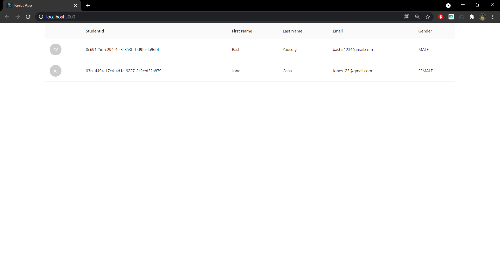
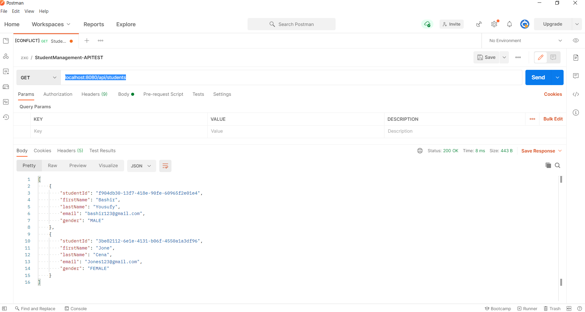

# StudentManagementSystem-Springboot-ReactJS

Simple Student Management System where it helps keep record of students.

Technologies used in this project are:
- Oracle database 
- SpringBoot to create restAPI from an oracle database
- React.js to fetch the data from api and display it in a table form.

